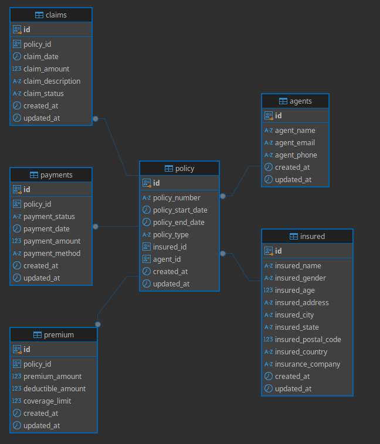

# Airflow Docker with PostgreSQL and CSV Loading DAG

Este proyecto contiene un contenedor Docker que levanta Apache Airflow y PostgreSQL, junto con un DAG que lee un archivo CSV y carga los datos en las tablas de PostgreSQL. Es ideal para automatizar procesos de ETL y carga de datos en bases de datos desde archivos CSV.

## Requisitos

- Docker
- Docker Compose
- Python 3.x

## Instalación

1. Clona este repositorio en tu máquina local:

   ```bash
   git clone https://github.com/daniersdan/test_monokera.git
   cd test_monokera

2. Construye los contenedores Docker utilizando `docker-compose`:

   ```bash
   docker-compose build
   ```

3. Levanta los servicios de Docker (Airflow y PostgreSQL):

   ```bash
   docker-compose up
   ```

4. Accede a la interfaz web de Airflow a través de tu navegador:

    - URL: `http://localhost:8080`
    - Usuario: `airflow`
    - Contraseña: `airflow`

5. El contenedor de PostgreSQL se levantará automáticamente y la base de datos será inicializada usando el script `init.sql`.

## Detalles del Proyecto

### Airflow DAG

El DAG principal (`dag.test_monokera.py`) está diseñado para:

- Leer un archivo CSV de ejemplo `MOCK_DATA.csv` ubicado en `./dags/src/policys/input/`.
- Procesar los datos con la lógica definida en el archivo `etl_policys.py`.
- En el procesamiento se detectan datos faltantes con id de tomadores de la policy, id de agentes etc, se tomo como pk datos no duplicados dentro de las columnas.
- En los formatos de fechas se aplico la normalizacion dejando todas las columnas en formta yyyy-mm-dd.
- Cargar los datos procesados a una base de datos PostgreSQL.

### Conexión a PostgreSQL

El archivo `postgres_connection.py` establece la conexión entre Airflow y PostgreSQL, usando las credenciales definidas en el archivo `docker-compose.yaml`.

### PostgreSQL

La base de datos PostgreSQL se inicializa con el script `init.sql`, que define las tablas necesarias para almacenar los datos del archivo CSV.

#### Diagrama ER 



Con la siguiente consulta SQL despues de ejecutar el dag y dejar las tablas cargadas, obtendran el reporte de todas las polizas que tienen fecha de finalizacion mayor al 01-07-2023

   ```bash
   select policy_number,
       to_char(policy_start_date, 'dd/mm/yyyy') as policy_start_date,
       to_char(policy_end_date, 'dd/mm/yyyy')   as policy_end_date,
       policy_type,
       insured_name,
       insured_gender,
       insured_age,
       insured_address,
       insured_city,
       insured_state,
       insured_postal_code,
       insured_country,
       insurance_company,
       agent_name,
       agent_email,
       agent_phone,
       premium_amount,
       deductible_amount,
       coverage_limit,
       to_char(claim_date, 'dd/mm/yyyy')        as claim_date,
       claim_amount,
       claim_description,
       claim_status,
       payment_status,
       to_char(claim_date, 'dd/mm/yyyy')        as payment_date,
       payment_amount,
       payment_method
from public.policy
         inner join public.agents a on a.id = policy.agent_id
         inner join public.claims c on policy.id = c.policy_id
         inner join public.insured i on i.id = policy.insured_id
         inner join public.premium p on policy.id = p.policy_id
         inner join public.payments p2 on policy.id = p2.policy_id
where policy_end_date > '2023-07-01';
   ```

### Plugins y Extensiones

El proyecto incluye un directorio `plugins` donde se pueden agregar plugins adicionales de Airflow.

## Uso

El DAG se ejecutará automáticamente cuando el contenedor de Airflow se inicie. Puedes verificar el estado del DAG y los logs de ejecución a través de la interfaz web de Airflow.

Para ejecutar el DAG manualmente:

1. Ingresa a la interfaz de Airflow.
2. Busca el DAG `test_monokera` y actívalo.
3. Ejecuta el DAG manualmente desde la UI o espera que se ejecute automáticamente.

## Personalización

- Modifica el archivo `MOCK_DATA.csv` con tus propios datos de entrada.
- Personaliza el script `etl_policys.py` para adaptarlo a la estructura de tu archivo CSV y las necesidades de procesamiento.
- Puedes agregar más DAGs dentro del directorio `dags` para tareas adicionales.

## Dependencias

Este proyecto utiliza las siguientes dependencias de Python (definidas en `requirements.txt`):

- Apache Airflow
- psycopg2 (conexión a PostgreSQL)
- pandas (para manipulación de datos CSV)


## Contribución

Las contribuciones son bienvenidas. Si deseas contribuir, por favor sigue estos pasos:

1. Haz un fork del proyecto.
2. Crea una rama para tu característica (`git checkout -b feature/mi-nueva-caracteristica`).
3. Realiza tus cambios y haz commit (`git commit -am 'Agrega mi nueva característica'`).
4. Empuja tus cambios a tu fork (`git push origin feature/mi-nueva-caracteristica`).
5. Crea un Pull Request.